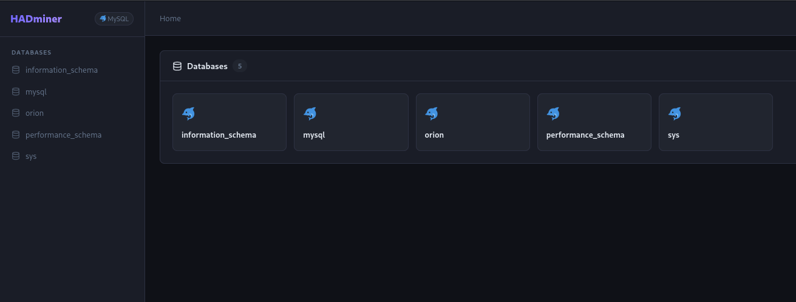
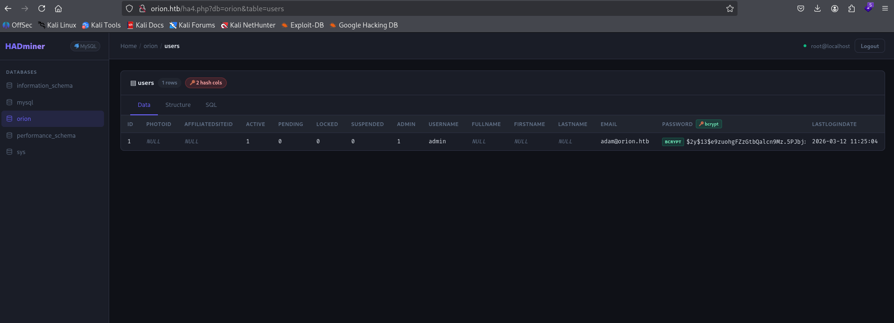

# HADminer

> A modern, single-file PHP database manager — a powerful alternative to Adminer.

Drop one file on any PHP server and get a full database management interface with a clean dark UI, multi-engine support, intelligent hash detection, and a built-in SQL editor.

---

## Screenshots

### Login — Driver auto-detection


### Database overview


### Table list with row counts & empty detection


### Hash detection in action (bcrypt detected automatically)


---

## Why HADminer over Adminer?

| Feature | HADminer | Adminer |
|---|---|---|
| **UI** | Modern dark theme, clean layout | Dated, minimal styling |
| **Hash detection** | Auto-detects MD5, SHA-*, bcrypt, Argon2, WordPress, Drupal... | None |
| **Hash strength indicator** | Color-coded badges (weak/medium/strong) | None |
| **Empty table detection** | Row counts on all tables in 1 query, InnoDB-aware verification | None |
| **Table filter** | Live search + "Hide empty" checkbox | None |
| **SQL editor** | Built-in with Ctrl+Enter shortcut + query history | Basic |
| **Query history** | Last 20 queries saved per session | None |
| **Driver auto-detect** | Tries MySQL → PostgreSQL → SQLite automatically | Manual only |
| **SQLite support** | File path input, no credentials needed | Yes |
| **Single file** | ✅ `hadminer.php` | ✅ `adminer.php` |
| **No dependencies** | ✅ Pure PHP, no Composer, no npm | ✅ |
| **Security** | Identifiers validated server-side, read-only mode | Write access |

---

## Features

- **Multi-engine** — MySQL / MariaDB, PostgreSQL, SQLite with auto-detection
- **Intelligent hash detection** — 16+ algorithms detected automatically on any column:
  - Weak (red): MD5, NTLM, SHA-1, MySQL v3
  - Medium (orange): SHA-256, WordPress/phpBB, Werkzeug PBKDF2
  - Strong (green): bcrypt, Argon2, SHA-512, Drupal, Django PBKDF2
- **Smart table list** — row counts fetched in a single query, InnoDB empty-table fix, live filter, hide empty
- **SQL editor** — syntax-aware textarea, Ctrl+Enter to run, 20-query history, quick SELECT button
- **Read-only by default** — browse databases, tables, data and structure without risk of accidental writes
- **Zero setup** — no Composer, no npm, no config files

---

## Quick Start

```bash
# Option 1 — PHP built-in server
php -S localhost:8080 hadminer.php

# Option 2 — Copy to Apache/Nginx webroot
cp hadminer.php /var/www/html/
```

Then open `http://localhost:8080` in your browser.

---

## Requirements

- PHP 8.1+
- Extensions: `pdo`, `pdo_mysql` (+ `pdo_pgsql` / `pdo_sqlite` as needed)
- See `requirements.txt` for full details

---

## Security Notes

- Credentials are stored in the PHP session only (never in cookies or URL)
- Table and database names are validated against actual server objects before use (prevents injection via URL manipulation)
- All output is HTML-escaped
- Designed for internal / pentest use — do not expose to the public internet without additional authentication

---

## License

MIT
